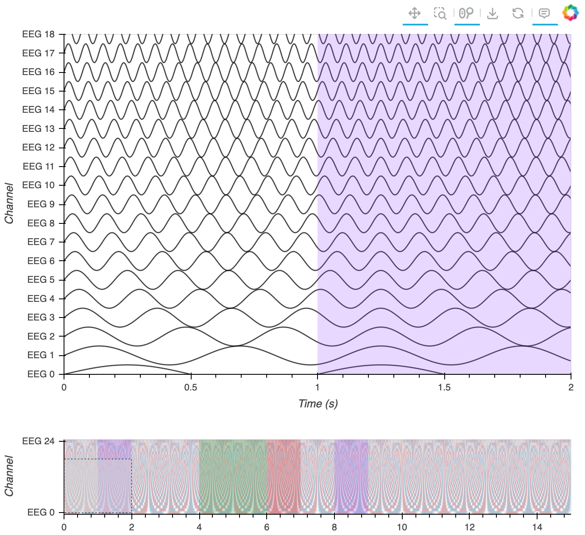
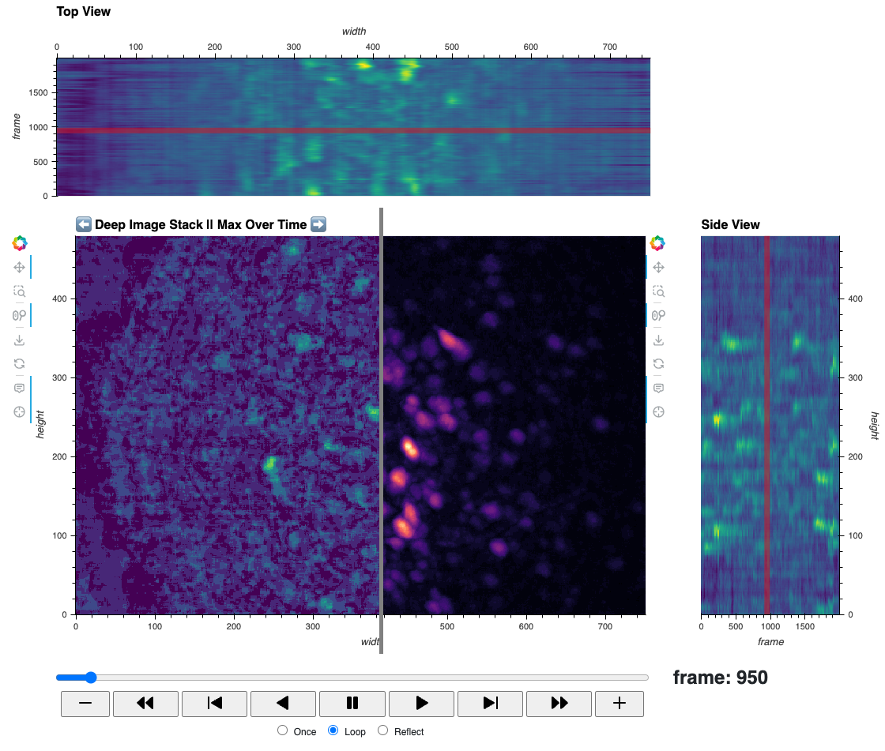
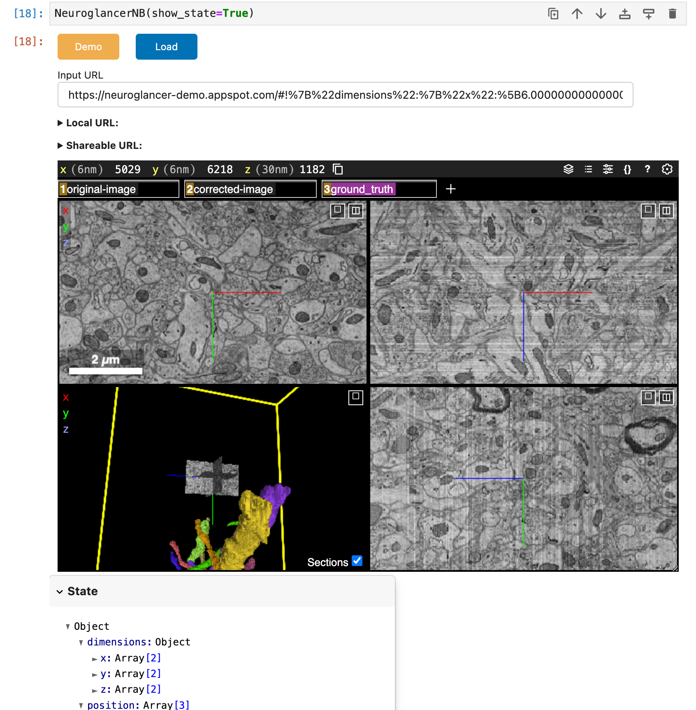

# [HoloViz+Bokeh for Neuroscience](https://github.com/holoviz-topics/neuro)

> :warning: This work is in early development and changing rapidly. It is not ready for scientific use. :warning:

## Why does Neuroscience need HoloViz+Bokeh?

We hypothesize the process of science stands to benefit from having the option to suddenly become interactive and shareable - allowing for the poking or plucking, pushing or pulling, drilling in or out, grouping or separating, and sending or receiving of what would otherwise be a static snapshot of the data. The combined use of HoloViz and Bokeh tools could provide the interactivity, shareability, and scalability needed to support research as a collective action rather than a collection of solitary observations.


### What is the purpose of this GitHub repository?

One of our overall goals is to facilitate the creation of fully open, reproducible,
OS-independent, browser-based workflows for biomedical research primarily using
sustainable, domain-independent visualization tools. In support of this
goal, this repository is the **development ground for optimization of
[HoloViz](https://github.com/holoviz/) and [Bokeh](https://github.com/bokeh/bokeh) tools within the realm of neuroscience.**

**Specific repo objectives:**
  
- **Workflow Development:** Host the development versions of workflows, facilitating consistency and code sharing across them.
- **Collaboration Hub:** Foster collaborative efforts between the developer teams and scientific collaborators outside these groups - aiming to effectively tailor development to specific requirements of the neuroscience community.
- **Project Management:** Track ideas, feedback, requirements, specifications, issues, requests, topic research, and progress in the associated [Project Board](https://github.com/orgs/holoviz-topics/projects/1) and [Meeting Notes](https://github.com/holoviz-topics/neuro/wiki/Meeting-Notes).
- **Host Domain-Specific Scripts:** For instance, simulated data generators.
- **Temporarily Host Benchmark Tooling:** Eventually, to be be migrated to a dedicated, domain-independent repository.

### What are workflows?

This repository contains developmental versions of workflows, which can be loosely categorized into two types: **generalized** and **specialized**. Generalized workflows aim to be broadly applicable and primarily utilize domain-independent [Pandata](https://github.com/panstacks/pandata) tools such as Numpy, Pandas, Xarray, SciPy, etc. These generalized workflows serve as the foundational building blocks for specialized workflows. Specialized workflows are designed to cater to specific contexts and have no limitations on the use of domain-specific tools.

## **Generalized Workflows in Development**:

| Title | Example Modality | Thumbnail | Info & Links | Description |
| --- | --- | --- | --- | --- |
| Multi-Channel Timeseries | eeg, ephys | <a href="./workflows/multi_channel_timeseries/assets/231024_MChanTS.png"></a> | :warning: <br> [workflow](./workflows/multi_channel_timeseries/index.ipynb) | Synchronized examination of stacked time-series with large data handling, scale bar, annotations, minimap, and signal grouping.
| Deep Image Stack | miniscope imaging | <a href="./workflows/deep_image_stack/assets/2024-06-24_DeepImageStack_square.png"></a> | :warning:  <br> [workflow](./workflows/deep_image_stack/workflow_deep-image-stack.ipynb) | Efficient visualization of deep 2D calcium imaging movies with, playback controls, 2D annotation, scale bar, time views, intensity histogram, and summary statistics. |
| Waveform | ephys | <a href="./workflows/waveform_snippets/assets/230524_waveform.png"></a> | :warning: <br> [workflow](./workflows/waveform_snippets/workflow_waveform.ipynb) | Oscilloscope-style display of action potential waveform snippets |
| Spike Raster | ephys | <a href="./workflows/spike_raster/assets/230524_spike-raster.png"></a> | :warning: <br> [workflow](./workflows/spike-raster/workflow_spike-raster.ipynb) | Efficient visualization of large-scale neuronal spike time data, with a simple API, aggregate views of spike counts, and spike-level metadata management |

-  Streaming data - extend the ephys, eeg, and/or video viewer workflows to
  display live streaming data.
-  Multimodal - visualizing and aligning ca-imaging with simultaneously recorded (but
  differently sampled) timeseries like  EEG, EMG, and/or behavior. Alternatively,
  visualizing behavioral video (eye tracking, maze running) with timeseries data.
-  Linked electrode-array layout

## **Specialized Workflows in Development**:

| Title | Example Modality | Thumbnail | Info & Links | Description |
| --- | --- | --- | --- | --- |
| Neuroglancer notebook | electron microscopy, histology | <a href="./workflows/neuroglancer_notebook/assets/20240612_neuroglancerNB.png"></a> | :warning: <br> [workflow](./workflows/neuroglancer_notebook/neuroglancer-nb-workflow.ipynb) | Notebook-based workflow for visualizing 3D volumetric data in a [Neuroglancer](https://github.com/google/neuroglancer?tab=readme-ov-file) application|

-  Spike Motif
-  MNE integration
-  Minian CNMF Temporal update parameter exploration app long timeseries
  improvement
workflows/neuroglancer_notebook/assets/20240612_neuroglancerNB.png

## Dissemination
- Workflows will be shared with the broader scientific community as they are ready. The target date for a first round of workflows is the end of 2024. Completed workflows will be listed on [examples.holoviz.org](https://examples.holoviz.org/gallery/index.html), while select aspects will also go into the relevant Bokeh and HoloViz documentation pages.
- Workflow progress will be presented at the [CZI open science](https://chanzuckerberg.com/science/programs-resources/open-science/) conference in Boston, MA in June 2024. 
- If you have ideas for where our workflows might be cross-linked of hosted, please reach out! We would love it if there was also a central place for bioscience workflows, like the Geoscience community has with [Project Pythia](https://projectpythia.org/).

## Get Involved
- We are actively looking for opportunities to deliver tutorials, workshops, or other educational resources to help researchers in underrepresented communities effectively utilize our tools. Reach out on [Discord](https://discord.gg/rb6gPXbdAr) if you want to brainstorm some ideas!
- Visit the [Community page on HoloViz.org](https://holoviz.org/community.html) for more ways to join the conversation.
- If you want to contribute to the workflows or underlying libraries, read on for installation and contribution instructions.


## Who is behind this effort?

This work is a collaboration between developers and scientists, and some developer-scientists. While some contributions are visible through the GitHub repo, many other contributions are less visible yet equally important.

Funding:
- 2023 - 2024: Chan Zuckerberg Initiative. Learn more in the [grant announcement](https://blog.bokeh.org/announcing-czi-funding-for-bokeh-for-bioscience-5f74426c011a).

## Need to contact us?
- Project Lead: Dr. Demetris Roumis (@droumis on [Discord](https://discord.gg/X6Eq9CvZZn))
- HoloViz Director: Dr. James (Jim) Bednar (@jbednar on [Discord](https://discord.gg/X6Eq9CvZZn))
- Bokeh Director: Bryan Van de Ven (bryan@bokeh.org)

---

# Contributors
## Installation for individual workflows with Conda

### Prerequisites
Before installing the workflow environments, make sure you have Miniconda installed. If not, you can download and install it from the [official site]([https://docs.conda.io/en/latest/miniconda.html](https://docs.conda.io/projects/miniconda/en/latest/index.html#quick-command-line-install)).

### Initial Installation Steps

1. **Clone the Repository**: Clone the `neuro` repository to your local machine.
    ```bash
    git clone https://github.com/holoviz-topics/neuro.git
    ```

2. **Navigate to Workflow**: Change to the directory of the workflow you're interested in.
    ```bash
    cd neuro/workflows/<workflow>
    ```

3. **Create Environment**: Use `conda` to create a new environment from the `environment.yml` file.
    ```bash
    conda env create -f environment.yml
    ```

4. **Activate Environment**: After the environment is created, activate it.
    ```bash
    conda activate <environment>
    ```


### Updating Workflow Environments

If you've already installed a workflow environment and the `environment.yml` file has been updated, follow these steps to update the environment:

1. **Update Repository**: Pull the latest changes from the repository.
    ```bash
    git pull
    ```

2. **Navigate to Workflow**: Go to the directory of the workflow you're interested in.
    ```bash
    cd neuro/workflows/<workflow>
    ```

3. **Update Environment**: Update the existing Conda environment based on the latest `environment.yml` file.
    ```bash
    conda env update -f environment.yml --prune
    ```

The `--prune` option will remove packages from the environment not present in the updated `environment.yml` file.


---
## Resources for Contributing

- **Task Management:** As workflows are developed and honed, performance and UI bottlenecks will be identified and addressed. Some improvements for the workflows themselves will be within this repo, but many improvements will be in the appropriate underlying libraries within the [HoloViz](https://github.com/holoviz/), [Bokeh](https://github.com/bokeh), or other GitHub Organizations. We will do our best to track the disparate tasks related to these efforts into this 
[project board](https://github.com/orgs/holoviz-topics/projects/1).
- **Communication:** 
  - Meeting minutes: Logged in the
  [Wiki > Meeting Notes](https://github.com/holoviz-topics/neuro/wiki/Meeting-Notes) whenever possible.
  - [HoloViz Discord #neuro channel](https://discord.gg/X6Eq9CvZZn) for real-time chat (if archived, post on the General HoloViz Discord channel)
  - [holoviz-topics/neuro GitHub repo issue
    tracker](https://github.com/holoviz-topics/neuro/issues)
- **Specifications and Research:** The [Wiki](https://github.com/holoviz-topics/neuro/wiki) has some data specifications and modality notes.
- **Data Generation:** To assist the development using real data, some workflows utilize simple data generators to help benchmark across data and parameter space. As the data generators/simulators can be useful to multiple workflows, they are kept as a separate module ([`/src/neurodatagen`](./src/neurodatagen)).
- **Visualization source code:** If there is visualization code or utilities that we want to live separate from the individual workflows, we can store them in [`/src/hvneuro`](./src/hvneuro) for now. However, this should be considered a temporary space until the code can be incorporated into existing libraries, or live in particular workflows.
- **Repo Structure and dev patterns:** 
    ```
    /workflows
      /example1
        readme_example1.md
        workflow_example1.ipynb
        environment.yml
        /dev
            date_example-workflow_task.ipynb
    ```
  - Use `readme_<workflow>.md` for any essential workflow-specific info or links.
  - Maintain `workflow_<workflow>.ipynb` as the latest version of the workflow.
  - Each workflow should have an `environment.yml` with which to create a conda env
  - The `dev` dir in each workflow is scratch space. There is no expectation that anything here is maintained.