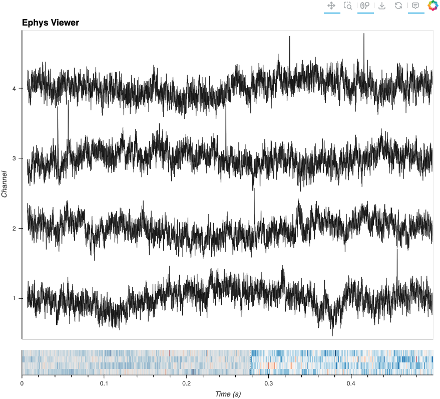
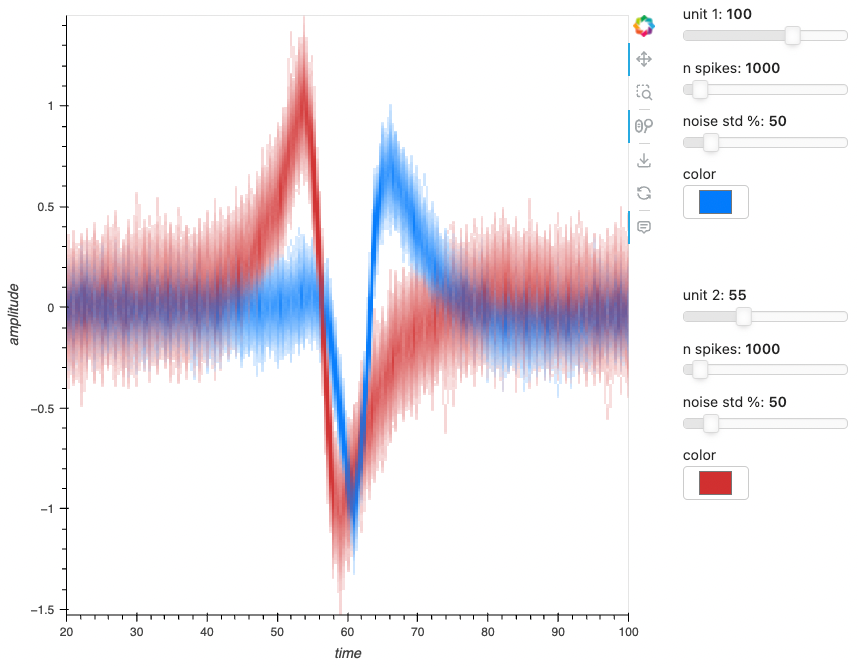

# [HoloViz+Bokeh for Neuroscience](https://github.com/holoviz-topics/neuro)

> :warning: This work is in early development and changing rapidly. It is not ready for scientific use. :warning:

### What is this repo?

Our ultimate goal is to facilitate the creation of fully open, reproducible, OS-independent, browser-based workflows for biomedical research. In support of this goal, this repository is the development ground for optimization and demonstration of HoloViz and Bokeh tools within the realm of neuroscience.

<details>
<summary> Urgent objectives: </summary>
  
- **Workflow Development:** Host the development of workflows.
- **Code Sharing:** Promote consistency and facilitate sharing of code across different workflows.
- **Collaboration:** Foster collaborative efforts between the HoloViz+Bokeh development teams and scientific collaborators outside these groups. This cross-collaboration aims to effectively tailor the tools to the specific requirements of the neuroscience community.
- **Issue Identification and Resolution:** As part of ongoing development, identify and address any performance or user interface bottlenecks in the workflows to optimize their usage and effectiveness.
- **Benchmarking and Testing Integration:** Host benchmarking work that involves the use of real and simulated data to assess the performance and functionality of the tools under relevant conditions.

</details> 

<details>
<summary> Slightly less urgent objectives: </summary>

- **Improvement and Refinement:** Over time, enhance, improve, and refine the developed workflows based on user feedback and advancements in the field.
- **Dissemination:** Eventually, share workflows with the broader scientific community. It's unclear yet where these all will be showcased, but at least some will go to examples.holoviz.org.
- **Education and Community Building:** Undertake educational and community-building activities such as providing tutorials, workshops, other educational resources to help researchers effectively utilize the developed tools.
- **Host Domain-Specific Package:** It is possible that not all required code for workflows will be accepted or appropriate for integrations into domain-independent HoloViz/Bokeh packages. Therefore, this repo *might* end up hosting code to be packaged as a domain-specific extension. TBD!

</details>

<details>
<summary> Roadmap: </summary>

- At a high-level: TODO
- An incomplete task roadmap is visible on this project board view (TODO)

</details>
  
### What are workflows?

This repo contains the development versions of workflows that can be categorized into 'generalized' and 'specialized'. The goal of a general workflow is to be generalizable, and should therefore focus on domain-independent tools (Numpy, Pandas, Xarray, etc). Generalized workflows will become the building blocks for specialized workflows. Specialized workflows aim to focus on a specific context with no restraint on the use of domain-specific tools (MNE, Minian, etc).

*(TODO: add/inherit short descriptions)*

**Generalized Workflows**:

<table align="center">
  <tr>
  <td>
      <!-- Title -->
      <h3>Ephys Viewer</h3>
      <!-- Thumbnail link to demo -->
      <a href="./workflows/ephys-viewer/workflow_ephys-viewer.ipynb">
        
      </a>
      <p>
      <!-- Additional content -->
      
      <p>
      <a href="./workflows/ephys-viewer/readme_ephys-viewer.md">readme</a>
      <p>
      <a href="./workflows/ephys-viewer/workflow_ephys-viewer.ipynb"> workflow</a>
    </td>

  <td>
      <!-- Title -->
      <h3>Waveform</h3>
      <!-- Thumbnail link to demo -->
      <a href="./workflows/waveform/workflow_waveform.ipynb">
        
      </a>
      <p>
      <!-- Additional content -->
      
      <p>
      <a href="./workflows/waveform/readme_waveform.md">readme</a>
      <p>
      <a href="./workflows/waveform/workflow_waveform.ipynb"> workflow</a>
    </td>
  <td>
      <!-- Title -->
      <h3>Spike Raster</h3>
      <!-- Thumbnail link to demo -->
      <a href="./workflows/spike-raster/workflow_spike-raster.ipynb">
        
      </a>
      <p>
      <!-- Additional content -->
      
      <p>
      <a href="./spike-raster/readme_spike-raster.md">readme</a>
      <p>
      <a href="./spike-raster/workflow_spike-raster.ipynb"> workflow</a>
    </td>
  <!-- </tr>
  <tr> -->
    <td>
      <!-- Title -->
      <h3>EEG Viewer</h3>
      <!-- Thumbnail link to demo -->
      <a href="./workflows/eeg-viewer/workflow_eeg-viewer.ipynb">
        
      </a>
      <p>
      <!-- Additional content -->
      
      <p>
      <a href="./workflows/eeg-viewer/readme_eeg-viewer.md">readme</a>
      <p>
      <a href="./workflows/eeg-viewer/workflow_eeg-viewer.ipynb"> workflow</a>
    </td>
    <td>
      <!-- Title -->
      <h3>Video Viewer</h3>
      <!-- Thumbnail link to demo -->
      <a href="./workflows/video-viewer/workflow_video-viewer.ipynb">
        
      </a>
      <p>
      <!-- Additional content -->
      
      <p>
      <a href="./workflows/video-viewer/readme_video-viewer.md">readme</a>
      <p>
      <a href="./workflows/video-viewer/workflow_video-viewer.ipynb"> workflow</a>
    </td>
  </tr>
</table>

**Specialized Workflows**:

1. Spike Motif Viewer [, readme, workflow]
2. MNE EEG App [, readme, workflow]
3. Minian CNMF App [, readme, workflow]

---
## Contributing

- **Task Management:** As workflows are developed and honed, performance and UI bottlenecks will be identified and addressed. Some improvements for the workflows themselves will be within this repo, but many improvements will be in the appropriate underlying libraries within the [HoloViz](https://github.com/holoviz/), [Bokeh](https://github.com/bokeh), or other GitHub Organizations. We will do our best to track the disparate tasks related to these efforts into this [project board](https://github.com/orgs/holoviz-topics/projects/1).
- **Meeting minutes:** Logged in the [Wiki](https://github.com/holoviz-topics/neuro/wiki) whenever possible.
- **Specifications:** The [Wiki](https://github.com/holoviz-topics/neuro/wiki) has some data specifications and modality notes (in progress).
- **Data Generation:** To assist the development using real data (TODO: add link), some workflows utilize simple data generators to help benchmark across data and parameter space. As the data generators/simulators can be useful to multiple workflows, they are kept as a separate and importable module ([`/src/neurodatagen`](./src/neurodatagen)).
- **Visualization source code:** If there is visualization code or utilities that we want to live separate from the individual workflows, we can store them in [`/src/hvneuro`](./src/hvneuro). However, it's unclear whether this will be released as a new package, incorporated into existing packages, or live in particular workflows. TBD 
- **Repo Structure and dev patterns:** 
    ```
    /workflows
      /example1
        readme_example1.md
        workflow_example1.ipynb
        environment.yml
        /dev
            date_example-workflow_task.ipynb
    ```
  - Use `readme_<workflow>.md` for any essential workflow-specific info or links.
  - Maintain `workflow_<workflow>.ipynb` as the latest version of the workflow.
  - Each workflow should have an `environment.yml` with which to create a conda env that will install the `neurodatagen` module in dev mode.
  - Use the `dev` dir in each workflow as shared scratch space within the `main` branch. There is no expectation that anything here is maintained.

---
## Who is behind this?

This work is a collaboration between developers and scientists, and some developer-scientists. While some contributions are visible through the GitHub repo, many other contributions are less visible yet equally important.

Funding:
- 2023 - 2024: Chan Zuckerberg Initiative. Learn more in the [grant announcement](https://blog.bokeh.org/announcing-czi-funding-for-bokeh-for-bioscience-5f74426c011a).

---

## Why Neuroscience?

Multiple (probably all) HoloViz+Bokeh developers believe that helping people through the furthering of clinically impactful science is a worthy pursuit and in need of a data visualization boost.

## Why HoloViz+Bokeh?

We hypothesize that the visualization within the process of working always benefits from having the option to suddenly become interactive and shareable - allowing for the poking or plucking, pushing or pulling, drilling in or out, grouping or separating, and sending or receiving of what would otherwise be a static snapshot of the data. The combined use of HoloViz and Bokeh tools provides the interactivity and shareability needed to support research as a collective action rather than a collection of solitary observations.
