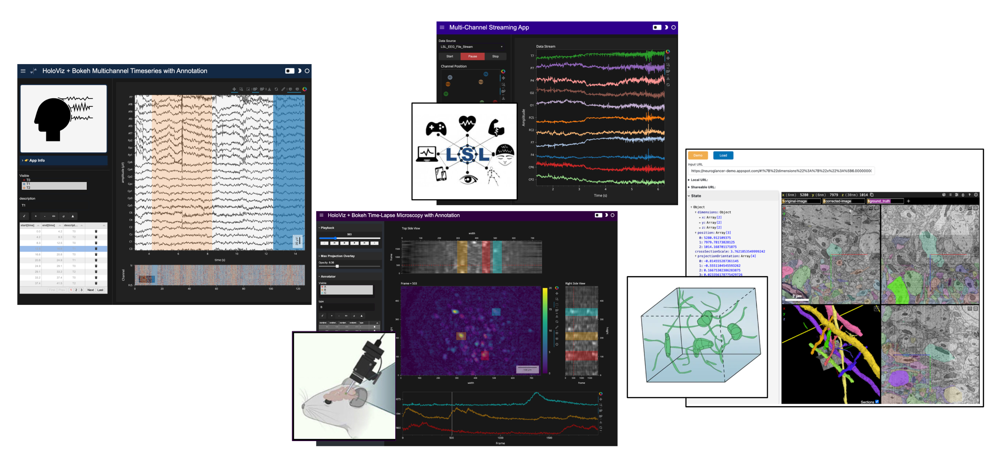

We're excited to announce the completion of our two-year [grant](https://chanzuckerberg.com/eoss/proposals/bokeh-raster-image-and-time-series-improvements-for-biomedical-applications/) from the Chan Zuckerberg Initiative's Essential Open Source for Science program (CZI EOSS). This project has significantly enhanced both [Bokeh](https://bokeh.org) and the [HoloViz](https://holoviz.org) ecosystem, particularly focusing on interactive visualization needs in neuroscience and broader biomedical research.

## The Bokeh and HoloViz Ecosystem

[Bokeh](https://bokeh.org) provides the foundational open-source architecture for creating interactive visualizations in web browsers, handling everything from rendering graphics to managing user interactions. The HoloViz ecosystem builds upon this foundation, providing higher-level ([HoloViews](https://holoviews.org)) and familiar ([hvPlot](https://hvplot.holoviz.org)) interfaces with additional capabilities for large datasets ([Datashader](https://datashader.org)) and building dashboards ([Panel](https://panel.holoviz.org)). Improvements to Bokeh's core capabilities enhance all of these tools, while advances in the HoloViz ecosystem extend the functionality and make these powerful features more accessible to data scientists and researchers. Check out our companion [Bokeh blog post](https://blog.bokeh.org/bokeh-for-bioscience-1e8ec629dd5a) for more details on the work completed in Bokeh.

## Why This Matters

Neuroscience generates an incredible variety of data types that present unique visualization challenges. This includes 1D electrical recordings from an array of sensors that must be analyzed simultaneously or even in real-time while streaming, 2D frames from time-lapse microscopy of neural activity in behaving animals, and large-scale 3D reconstructions of brain tissue. Scientists across biomedical research need tools that can handle diverse data types while enabling collaboration and reproducibility, without having to rely on expensive proprietary software that cannot easily be customized or shared between researchers.

## Two Complementary Approaches

Our project took a two-pronged approach. We first created example workflows that demonstrate how to tackle common visualization challenges in neuroscience. These workflows helped identify needed improvements in our libraries. We then made substantial enhancements to the underlying tools, which in turn enabled more powerful workflows. This iterative process ensured our technical improvements directly addressed the most pressing scientific needs.

## Example Workflows

### [Multichannel Timeseries](https://examples.holoviz.org/gallery/multichannel_timeseries)

Often the first step towards understanding brain activity is to display many time-aligned signals simultaneously, each representing the activity of different neurons, brain regions, or other experimental measures. We've developed two complementary workflows to handle these datasets. Both workflow approaches make use of new support for embedding multiple subcoordinate axes into a single plot, allowing users to compare timeseries with different units or of very different amplitudes. Additionally, both workflows are now compatible with [HoloNote](https://github.com/holoviz/holonote) for annotating time-spans, as well the use of a minimap to provide a stable, global view of the data along with subcoordinate-compatible scalebar and zoom tools.



For moderate-sized recordings, our in-memory processing system provides immediate interactivity while intelligently downsampling data to maintain the signal shape and provide smooth performance. Researchers can freely zoom, pan, and measure their data while maintaining the visual integrity in their signals.



For massive datasets that exceed available memory, we've created a multi-resolution pyramid system inspired by modern map viewers – showing an overview of the entire dataset while dynamically loading higher-resolution details as researchers zoom in. This approach automatically manages data resolution based on the current view, ensuring researchers can navigate smoothly through recordings containing billions of samples.

This versatility ensures that whether working with a few dozen signals or tens of thousands, researchers can explore their data efficiently.

### [Time-Lapse Microscopy](https://examples.holoviz.org/gallery/timelapse_microscopy)



Neuroscientists often use specialized microscopes to watch neural activity unfold frame-by-frame in living tissue, generating long sequences of images that capture cellular dynamics. Researchers working with these recordings can now use our tools to navigate through time while maintaining their spatiotemporal context through synchronized side views and dynamic scale bars. By marking regions of interest, they can extract and analyze signals from specific cellular structures, combining qualitative observations with quantitative measurements. New support for overlaid projections helps identify active spatial regions regardless of when they appear in time.

### [Volumetric Imaging](https://examples.holoviz.org/gallery/volumetric_imaging)



Modern electron microscopes can create incredibly detailed 3D reconstructions of brain tissue, revealing the intricate connections between neurons. Our new [panel-neuroglancer](https://github.com/panel-extensions/panel-neuroglancer) extension brings the power of Google's Neuroglancer viewer directly into the scientific notebook context. Researchers can now seamlessly combine 3D volumetric visualization with analysis and narrative context in Jupyter notebooks, making it easier to explore massive datasets, share specific views with collaborators, integrate visualization into their computational workflows, or embed the neuroglancer viewer in a custom dashboard. This integration bridges the gap between visual exploration and quantitative analysis.

### [Streaming Timeseries](https://examples.holoviz.org/gallery/streaming_timeseries)



Neuroscience experiments often generate continuous streams of data that need to be visualized and analyzed in real-time. We've enhanced our streaming visualization capabilities to handle the complexities of live data, allowing researchers to monitor experiments as they play out. Our improvements make it possible to smoothly display incoming data from various sources, including the common [Lab Streaming Layer](https://labstreaminglayer.readthedocs.io/info/intro.html). Researchers can now create rich, interactive displays that combine raw signals with derived measurements, and even show the spatial arrangement of recording electrodes or sensors. The system is particularly flexible, supporting both standard laboratory streaming protocols and custom data sources, while enabling scientists to pause, review, and resume their data streams without losing information.

## Foundational Improvements

These workflows above build upon substantial improvements we've made to the underlying libraries. Looking under the hood reveals a range of enhancements that strengthen not just these specific applications but the entire ecosystem of tools built on Bokeh and HoloViz. Here are just a few of the changes we've made:

In Bokeh:

- **Interactive control for Independent subcoordinate axes**: Scientists often need to compare signals with very different scales or units (e.g. voltage, pressure, position). Our developments lets them stack and interact with these cleanly while maintaining appropriate scales for each (e.g., [bokeh#13345](https://github.com/bokeh/bokeh/pull/13345), [bokeh#13826](https://github.com/bokeh/bokeh/pull/13826))
- **Accelerated image display**: Modern microscopes produce high-resolution images that need smooth, responsive visualization. New WebGL support helps makes this possible even for large, rapidly updating images (e.g., [bokeh#13176](https://github.com/bokeh/bokeh/pull/13176))
- **Digital measurement tools**: Just as scientists use physical measurement tools in the lab, we added customizable scalebars that automatically adjust to different zoom levels (e.g., [bokeh#13625](https://github.com/bokeh/bokeh/pull/13625), [bokeh#14005](https://github.com/bokeh/bokeh/pull/14005))
- **Smarter navigation tools**: Exploring complex datasets requires intuitive navigation. Our improved range tool and zoom functions make it easier to focus on regions of interest (e.g., [bokeh#13322](https://github.com/bokeh/bokeh/pull/13322))

In HoloViz:

- **Efficient data handling**: Large datasets need smart data loading to maintain responsiveness. Our viewport-aware system only transmits the data you're currently viewing (e.g., [holoviz/holoviews#6017](https://github.com/holoviz/holoviews/pull/6017))
- **Intelligent downsampling**: When viewing long time periods, we intelligently reduce data while preserving important features like peaks and valleys (e.g., [holoviz/holoviews#6059](https://github.com/holoviz/holoviews/pull/6059))
- **Enhanced multi-signal display**: Building on Bokeh's new coordinate system, we made it easier to create publication-quality visualizations of multiple synchronized signals (e.g., [holoviz/holoviews#5840](https://github.com/holoviz/holoviews/pull/5840))
- **Optimized data structures**: Better handling of time indices means faster, more memory-efficient display of temporal data (e.g., [holoviz/holoviews#6061](https://github.com/holoviz/holoviews/pull/6061))
- **Improved live data handling**: Scientists can now pause streaming displays to examine interesting events, then resume without losing data (e.g., [holoviz/holoviews#6318](https://github.com/holoviz/holoviews/pull/6318))
- **Smoother updates**: New rendering approaches eliminate flickering and partial updates, ensuring stable, professional-looking displays (e.g., [holoviz/holoviews#6265](https://github.com/holoviz/holoviews/pull/6265))
- **Annotation enhancements**: Vectorized annotations stay synchronized across different views, maintaining context while exploring data from different angles (e.g., [holoviz/holonote#14](https://github.com/holoviz/holonote/issues/14), [holoviz/holonote#32](https://github.com/holoviz/holonote/pull/32))
- **User-friendly annotation interface**: A spreadsheet-like interface makes it easy to manage and edit marked regions in data (e.g., [holoviz/holonote#106](https://github.com/holoviz/holonote/pull/106))
- **Created [panel-neuroglancer](https://github.com/panel-extensions/panel-neuroglancer) extension**: Enables integration of Google's powerful Neuroglancer tool into Jupyter notebooks, making it easier to combine visualization, analysis, and narrative framing (e.g., [panel-extensions/panel-neuroglancer#3](https://github.com/panel-extensions/panel-neuroglancer/pull/3))

## Impact Beyond Neuroscience

While developed for neuroscience applications, these improvements benefit researchers across biomedicine. Geneticists looking at an array of 1D trackplots on subcoordinates, cell biologists tracking protein movements, and physiologists monitoring patient data all face similar visualization challenges. The enhancements we've made - from handling large datasets to creating interactive and interoperable visual components - provide powerful tools for solving problems across these diverse fields.

More broadly, any field dealing with time series, image data, or streaming measurements can benefit from these improvements. The foundational work in Bokeh benefits not just HoloViz users but the entire Python visualization ecosystem, as many other tools build upon Bokeh's capabilities.

## Try It Yourself

We've created detailed example workflows demonstrating these new capabilities:

- [Multichannel Timeseries](https://examples.holoviz.org/gallery/multichannel_timeseries): Two approaches for interactive visualization of synchronized neural signals
- [Time-Lapse Microscopy](https://examples.holoviz.org/gallery/timelapse_microscopy): Tools for analyzing fluorescence imaging data
- [Volumetric Imaging](https://examples.holoviz.org/gallery/volumetric_imaging): Integration of Neuroglancer for exploring 3D datasets
- [Streaming Timeseries](https://examples.holoviz.org/gallery/streaming_timeseries): Real-time visualization tools compatible with lab equipment

Each example includes complete documentation and can serve as a starting point for building your own workflows.

## Looking Forward

This work strengthens both the scientific Python ecosystem and Bokeh's position as a powerful tool for interactive visualization. As the biomedical research community continues to grow, these improvements will help more labs build open, reproducible workflows.

The features and optimizations developed during this project are now part of the core Bokeh and HoloViz libraries, available to all users through standard installation methods. We encourage you to try them out and let us know how they work for your specific needs.

## Learn More

- Join the discussion on our [HoloViz Discord channel](https://discord.gg/QdAw9R5RDV)
- Companion [Bokeh blog post](https://blog.bokeh.org/bokeh-for-bioscience-1e8ec629dd5a)

## Acknowledgments

This work was supported by the Chan Zuckerberg Initiative's Essential Open Source for Science program (Grant Number: 2022-309815). Special thanks to Bryan Van de Ven and James A. Bednar for project supervision, the HoloViz and Bokeh developers for their amazing engineering efforts, our scientific collaborators for their feedback and contributions, and the broader research software communities for their suggestions and encouragement throughout this project.
