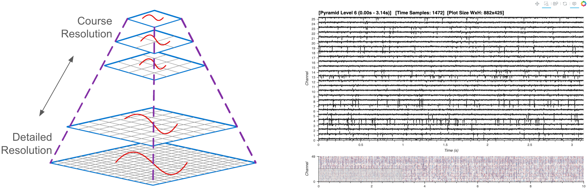
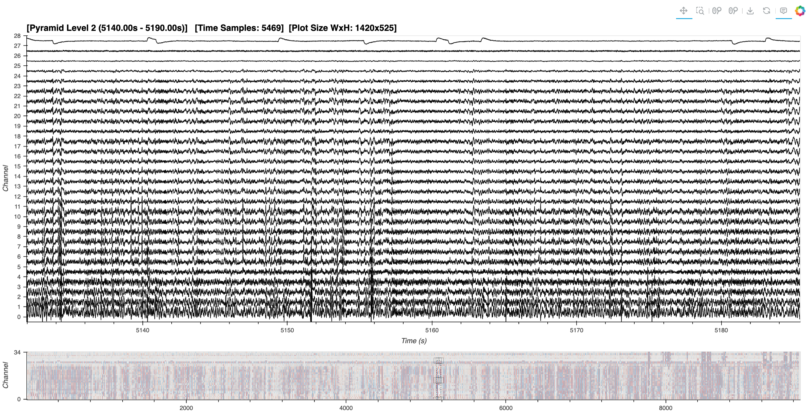

# Multichannel Timeseries with Large Datasets


<div style="border: 2px solid #ccc; border-radius: 8px; padding: 5px; display: inline-block;">
    
</div>


```python
from IPython.display import HTML
HTML("""
<div style="display: flex; justify-content: center; padding: 10px;">
    <iframe width="560" height="315" src="https://www.youtube.com/embed/bJf58B7SRA0?si=XLZ3unzoQXPWGzUA" title="YouTube video player" frameborder="0" allow="accelerometer; clipboard-write; encrypted-media; gyroscope; picture-in-picture; web-share" referrerpolicy="strict-origin-when-cross-origin" allowfullscreen></iframe>
</div>
""")

```

---

## Prerequisites

| What? | Why? |
| --- | --- |
| [Index: Intro, Workflows, Extensions](./index.ipynb) | For context and workflow selection/feature guidance |
| [Recommended Workflow](./multichan.ipynb) | For live downsampling with in-memory Pandas DataFrame |

## Overview

For an introduction, please visit the ['Index'](./index.ipynb) page. This workflow is tailored for processing and analyzing large multichannel timeseries data derived from [electrophysiological](https://en.wikipedia.org/wiki/Electrophysiology) recordings. It is more experimental and complex than the recommended workflow but, at the time of writing, provides a scalable solution at the cutting edge of development.

### What Defines a 'Large-Sized' Dataset?

A 'large-sized' dataset in this context is characterized by its size surpassing the available memory, making it impossible to load the entire dataset into RAM simultaneously. So, how are we to visualize a zoomed-out representation of the entire large dataset?

### Utilizing a Large Data Pyramid

In the 'medium' workflow, we employed downsampling to reduce the volume of data transferred to the browser, a technique feasible when the entire dataset already resides in memory. For larger datasets, however, we now adopt an additional strategy: the creation and dynamic access to a data pyramid. A data pyramid involves storing multiple layers of the dataset at varying resolutions, where each successive layer is a downsampled version of the previous one. For instance, when fully zoomed out, a greatly downsampled version of the data provides a quick overview, guiding users to areas of interest. Upon zooming in, tiles of higher-resolution pyramid levels are dynamically loaded. This strategy outlined is similar to the approach used in geosciences for managing interactive map tiles, and which has also been adopted in bio-imaging for handling high-resolution electron microscopy images. 

### Key Software:

Alongside [HoloViz](https://github.com/holoviz), [Bokeh](https://holoviz.org/), and [Numpy](https://numpy.org/), we make extensive use of several open source libraries to implement our solution:
- **[Xarray](https://github.com/pydata/xarray):** Manages labeled multi-dimensional data, facilitating complex data operations and enabling partial data loading for out-of-core computation.
- **[Xarray DataTree](https://github.com/xarray-contrib/datatree):** Organizes xarray DataArrays and Datasets into a logical tree structure, making it easier to manage and access different resolutions of the dataset. At the moment of writing, this is [actively being migrated](https://github.com/pydata/xarray/issues/8572) into the core Xarray library.
- **[Dask](https://github.com/dask/dask):** Adds parallel computing capabilities, managing tasks that exceed memory limits.
- **[ndpyramid](https://github.com/carbonplan/ndpyramid):** Specifically designed for creating multi-resolution data pyramids.
- **[Zarr](https://github.com/zarr-developers/zarr-python):** Used for storing the large arrays of the data pyramid on disk in a compressed, chunked, and memory-mappable format, which is crucial for efficient data retrieval.
- **[tsdownsample](https://github.com/predict-idlab/tsdownsample):** Provides optimized implementations of downsampling algorithms that help to maintain important aspects of the data.

### Considerations and Trade-offs
While this approach allows visualization and interaction with datasets larger than available memory, it does introduce certain trade-offs:

- **Increased Storage Requirement:** Constructing a data pyramid currently requires additional disk space since multiple representations of the data are stored.
- **Code Complexity:** Creating the pyramids still involves a fair bit of familiarity with the key packages, and their interoperability. Also, the plotting code involved in dynamic access to the data pyramid structure is still experimental, and could be matured into HoloViz or another codebase in the future.
- **Performance:** While this method can handle large datasets, the performance may not match that of handling smaller datasets due to the overhead associated with processing and dynamically loading multiple layers of the pyramid.

---

## Imports and Configuration


```python
from pathlib import Path

import numpy as np
import h5py
import dask.array as da
import xarray as xr
from xarray.backends.api import open_datatree # until API stabilizes

import panel as pn
import holoviews as hv

from ndpyramid import pyramid_create
from tsdownsample import MinMaxLTTBDownsampler

from IPython.display import display

hv.extension("bokeh")
pn.extension()
```


```python
DATA_URL = 'https://datasets.holoviz.org/lfp/v1/sub-719828686_ses-754312389_probe-756781563_ecephys.nwb'
DATA_DIR = Path('./data')
DATA_FILENAME = Path(DATA_URL).name
DATA_PATH = DATA_DIR / DATA_FILENAME
PYRAMID_FILE = f"{DATA_PATH.stem}.zarr"
PYRAMID_PATH = DATA_DIR / PYRAMID_FILE
print(f'Local Original Data Path: {DATA_PATH}')
print(f'Pyramid Path: {PYRAMID_PATH}')
```

<div class="admonition alert alert-warning">
    <p class="admonition-title" style="font-weight:bold">Warning</p>
    The following cell will download ~900 MB the first time it is run.
</div>


```python
DATA_DIR.mkdir(parents=True, exist_ok=True)
if not DATA_PATH.exists():
    import wget
    print(f'Data downloading to: {DATA_PATH}')
    wget.download(DATA_URL, out=str(DATA_PATH))
else:
    print(f'Data exists at: {DATA_PATH}')
```

## Inspecting the Raw File

In order to select the relevant parts of the original dataset that we are interested in, we first have to figure out how where they are in the database. The original NWB (HDF5) file format is like a file-system within a file. According to the [NWB docs](https://nwb-overview.readthedocs.io/en/latest/intro_to_nwb/2_file_structure.html#file-hierarchy), we should find the data in either the '`/acquisition`' or '`processing`' path groups. Let's write a function to quickly display everything in those groups. We are looking for 'LFP' data which will be a 2D array and the corresponding LFP data dimension vectors (time, electrodes).


```python
def print_hdf5_keys(filename, path='/'):
    """Prints all keys (paths) in an HDF5 file."""
    with h5py.File(filename, 'r') as f:
        for key in f[path].keys():
            full_path = f"{path}/{key}" if path != '/' else key
            print(full_path)
            if isinstance(f[full_path], h5py.Group):
                print_hdf5_keys(filename, full_path)
```


```python
print_hdf5_keys(DATA_PATH, path='/processing')
print_hdf5_keys(DATA_PATH, path='/acquisition')
```

It looks like our LFP `data` key is in `acquisition/probe_810755797_lfp_data`, along with the `electrodes` and `timestamps` dimensions. Don't worry about the multiple `lfp.../data` files, these paths point to the same underlying object. Let's note down the paths to our data objects of interest:


```python
DATA_KEY = "acquisition/probe_756781563_lfp_data/data"
DATA_DIMS = {"time": "acquisition/probe_756781563_lfp_data/timestamps",
             "channel": "acquisition/probe_756781563_lfp_data/electrodes",
            }
```

## Creating an Intermediate `Xarray` Dataset

Before building a data pyramid, we'll first we construct an `Xarray` version of our dataset from its original NWB (HDF5) format. We'll make use of `Dask` for parallel and 'lazy' computation, i.e. chunks of the data are only loaded when necessary, enabling operations on data that exceed memory limits. An impactful goal for future work would be to create the data pyramid directly from original NWB (HDF5) file and skip creation of this intermediate version.


```python
def serialize_to_xarray(f, data_key, dims):
    """Serialize HDF5 data into an xarray Dataset with lazy loading."""
    # Extract coordinates for the specified dimensions
    coords = {dim: f[coord_key][:] for dim, coord_key in dims.items()}
    
    # Load the dataset lazily using Dask
    data = f[data_key]
    dask_data = da.from_array(data, chunks=(data.shape[0], 1))
    
    # Create the xarray DataArray and convert it to a Dataset
    data_array = xr.DataArray(
        dask_data,
        dims=list(dims.keys()),
        coords=coords,
        name=data_key.split("/")[-1]
    )
    ds = data_array.to_dataset(name='data') #data_key.split("/")[-1]
    return ds
```


```python
f = h5py.File(DATA_PATH, "r")
ts_ds = serialize_to_xarray(f, DATA_KEY, DATA_DIMS)
ts_ds
```

## Building a Data Pyramid

We will feed our new `Xarray` data to `ndpyramid.pyramid_create`, also passing in the dimension that we want downsampled ('`time`'), a custom `apply_downsample` function that uses `xarray.apply_ufunc` to perform computations in a vectorized and parallelized manner, and `FACTORS` which determine the extent of each downsampled level. For instance, a factor of '2' halves the number of time samples, '4' reduces them to a quarter, and so on.

To each chunk of data, our custom `apply_downsample` function applies the `MinMaxLTTBDownsampler` from the `tsdownsample` library, which selects data points that best represent the overall shape of the signal. This method is particularly effective in preserving the visual integrity of the data, even at reduced resolutions. This may take some time depending on the amount of data.

<div class="admonition alert alert-warning">
    <p class="admonition-title" style="font-weight:bold">Warning</p>
    Ensure you have sufficient disk space to handle the new data pyramid prior to running this section. If using the demo data, this will create a ~3 GB file on disk.
</div>


```python
%%time

# The FACTORS will depend on the size of your dataset, available disk size, and the resolution needed
# For this demo, we are arbitrarily choosing 8 levels and scaling by quadrupling each preceding factor.
FACTORS = [4**i for i in range(8)]

def _help_downsample(data, time, n_out):
    """
    Helper function for downsampling and returning as a specific format.
    """
    indices = MinMaxLTTBDownsampler().downsample(time, data, n_out=n_out)
    return data[indices], indices


def apply_downsample(ts_ds, factor, dims):
    """
    Apply downsampling to a time series dataset.
    """
    dim = dims[0]
    n_out = len(ts_ds["data"]) // factor
    print(f"Downsampling by factor {factor} for a size of {n_out}.")
    ts_ds_downsampled, indices = xr.apply_ufunc(
        _help_downsample,
        ts_ds["data"],
        ts_ds[dim],
        kwargs=dict(n_out=n_out),
        input_core_dims=[[dim], [dim]],
        output_core_dims=[[dim], ["indices"]],
        exclude_dims=set((dim,)),
        vectorize=True,
        dask="parallelized",
        dask_gufunc_kwargs=dict(output_sizes={dim: n_out, "indices": n_out}),
    )
    # Update the dimension coordinates with the downsampled indices
    ts_ds_downsampled[dim] = ts_ds[dim].isel(time=indices.values[0])
    return ts_ds_downsampled.rename("data")


if not PYRAMID_PATH.exists():
    print(f'Creating Pyramid: {PYRAMID_PATH}')
    ts_dt = pyramid_create(
        ts_ds,
        factors=FACTORS,
        dims=["time"],
        func=apply_downsample,
        type_label="pick",
        method_label="pyramid_downsample",
    )
    display(ts_dt)
else:
    print(f'Pyramid Already Exists: {PYRAMID_PATH}')
```

### Save the Pyramid

Now we can easily persist the multi-level pyramid `to_zarr` format on disk. This may take some time depending on the amount of data.


```python
%%time

if not PYRAMID_PATH.exists():
    PYRAMID_PATH.parent.mkdir(parents=True, exist_ok=True)
    ts_dt.to_zarr(PYRAMID_PATH, mode="w")
```

## Dynamic Pyramid Plotting

Now that we've created our data pyramid, we can set up the interactive visualization.

Let's start fresh and get a handle to the data pyramid that we've saved to disk, making sure to specify the `zarr` engine.


```python
ts_dt = open_datatree(PYRAMID_PATH, engine="zarr")
ts_dt
```

If you expand the 'Group' dropdown above, you can see each pyramid level has the same number of channels, but different number of timestamps, since the time dimension was downsampled.

### Prepare the Data

First, we will prepare some metadata needed for plotting and define a helper function to extract a dataset at a specific pyramid level and channel.


```python
def _extract_ds(ts_dt, level, channels=None):
    """ Extract a dataset at a specific level"""
    ds = ts_dt[str(level)].ds
    return ds if channels is None else ds.sel(channel=channels)

# Grab the timestamps from the coursest level of the datatree for initialization
num_levels = len(ts_dt)
coarsest_level = str(num_levels-1)
time_da = _extract_ds(ts_dt, coarsest_level)["time"]
channels = ts_dt[coarsest_level].ds["channel"].values
num_channels = len(channels)
```

### Create Dynamic Plot

Now for the main show, we'll utilize a HoloViews `DynamicMap` which will call a custom function called `rescale` whenever there is a change in the visible axes' ranges (`RangeXY`) or the size of a plot (`PlotSize`).

Based on the changes and thresholds, a new plot is created using a new subset of the datatree pyramid.


<details> <summary> <strong>Want more details? </strong> </summary>

When the `rescale` function is triggered, it will first determine which pyramid `zoom_level` has the next closest number of data samples in the visible time range (`time_slice`) compared with the number of horizontal pixels on the screen.

Depending on the determined `zoom_level`, data corresponding to the visible time range is fetched through the `_extract_ds` function, which accesses the specific slice of data from the appropriate pyramid level.

Finally, for each channel within the specified range, a `Curve` element is generated using HoloViews, and each curve is added to the `Overlay` for a stacked multichannel timeseries visualization.

</details>
<br>


```python
X_PADDING = 0.2  # buffer x-range to reduce update latency with pans and zoom-outs

amplitude_dim = hv.Dimension("amplitude", unit="µV")
time_dim = hv.Dimension("time", unit="s") # match the index name in the df

def rescale(x_range, y_range, width, scale, height):

    # Handle case of stream initialization
    if x_range is None:
        x_range = time_da.min().item(), time_da.max().item()
    if y_range is None:
        y_range = 0, num_channels

    # define data range slice
    x_padding = (x_range[1] - x_range[0]) * X_PADDING
    time_slice = slice(x_range[0] - x_padding, x_range[1] + x_padding)
    channel_slice = slice(y_range[0], y_range[1])

    # calculate the appropriate pyramid level and size
    if width is None or height is None:
        pyramid_level = num_levels - 1
        size = time_da.size
    else:
        sizes = np.array([
            _extract_ds(ts_dt, pyramid_level)["time"].sel(time=time_slice).size
            for pyramid_level in range(num_levels)
        ])
        diffs = sizes - width
        pyramid_level = np.argmin(np.where(diffs >= 0, diffs, np.inf)) # nearest higher-resolution level
        # pyramid_level = np.argmin(np.abs(np.array(sizes) - width)) # nearest (higher or lower resolution) level
        size = sizes[pyramid_level]
    
    title = (
        f"[Pyramid Level {pyramid_level} ({x_range[0]:.2f}s - {x_range[1]:.2f}s)]   "
        f"[Time Samples: {size}]  [Plot Size WxH: {width}x{height}]"
    )

    # extract new data and re-paint the plot
    ds = _extract_ds(ts_dt, pyramid_level, channels).sel(time=time_slice, channel=channel_slice).load()

    curves = {}
    for channel in ds["channel"].values.tolist():
        curves[str(channel)] = hv.Curve(ds.sel(channel=channel), [time_dim], ['data'], label=str(channel)).redim(
            data=amplitude_dim).opts(
            color="black",
            line_width=1,
            subcoordinate_y=True,
            subcoordinate_scale=4,
            hover_tooltips = [
                ("channel", "$label"),
                ("time"),
                ("amplitude")],
            tools=["xwheel_zoom"],
            active_tools=["box_zoom"],
        )
        
    curves_overlay = hv.NdOverlay(curves, kdims="Channel", sort=False).opts(
            xlabel="Time (s)",
            ylabel="Channel",
            title=title,
            show_legend=False,
            padding=0,
            min_height=600,
            responsive=True,
            framewise=True,
            axiswise=True,
        )
    return curves_overlay
```


```python
range_stream = hv.streams.RangeXY()
size_stream = hv.streams.PlotSize()
dmap = hv.DynamicMap(rescale, streams=[size_stream, range_stream])
```

### Minimap

To assist in navigating the dataset, we integrate a minimap widget. This secondary minimap plot provides a condensed overview of the entire dataset, allowing users to select and zoom into areas of interest quickly in the main plot while maintaining the contextualization of the zoomed out view.

We will employ datashader rasterization of the image for the minimap plot to display a browser-friendly, aggregated view of the entire dataset. Read more about datashder rasterization via HoloViews [here](https://holoviews.org/user_guide/Large_Data.html).


```python
from scipy.stats import zscore
from holoviews.operation.datashader import rasterize
from holoviews.plotting.links import RangeToolLink

y_positions = range(num_channels)
yticks = [(i, ich) for i, ich in enumerate(channels)]

z_data = zscore(ts_dt[coarsest_level].ds["data"].values, axis=1)

minimap = rasterize(
    hv.QuadMesh((time_da, y_positions, z_data), ["Time", "Channel"], "Amplitude")
)

minimap = minimap.opts(
    cnorm='eq_hist',
    cmap="RdBu_r",
    alpha=0.5,
    xlabel="",
    yticks=[yticks[0], yticks[-1]],
    toolbar="disable",
    height=120,
    responsive=True,
)

tool_link = RangeToolLink(
    minimap,
    dmap,
    axes=["x", "y"],
    boundsy=(-0.5, len(channels) // 1.25),
)

app = (dmap + minimap).cols(1)
dmap.event(x_range=(5140, 5190)) # trigger an initial range event to get the appropriate pyramid layer
```

<div class="admonition alert alert-info">
    <p style="font-weight:bold; font-size: 16px;">⚠️ Heads up!</p>
    <p>Viewing this on <code>examples.holoviz.org</code>? This is a static version of the notebook 📄. Interactive features that require a live Python process, like downsampling and datashading, won’t work here 🚫. To use these features, open the notebook with a live Python session.</p>
</div>


```python
pn.Row(app).servable()
```

<div style="position: relative; display: inline-block;">
    
    <div style="
        position: absolute;
        top: 0;
        left: 0;
        width: 100%;
        height: 100%;
        display: flex;
        align-items: center;
        justify-content: center;
        font-size: 40px;
        color: rgba(255, 255, 255, 0.7);
        background-color: rgba(0, 0, 0, 0.25);
        text-align: center;
        border-radius: 5px;
    ">
        Static Preview
    </div>
</div>

## What Next?

- Review the [Time Range Annotation Extension](./time_range_annotation.ipynb) to create, edit, and save start/end times, and view categorized ranges overlaid on the multichannel timeseries plot.

## Related Resources

| What? | Why? |
| --- | --- |
| [xarray Datatree Docs](https://docs.xarray.dev/en/stable/generated/xarray.DataTree.html) | Reference the API for Datatree |
