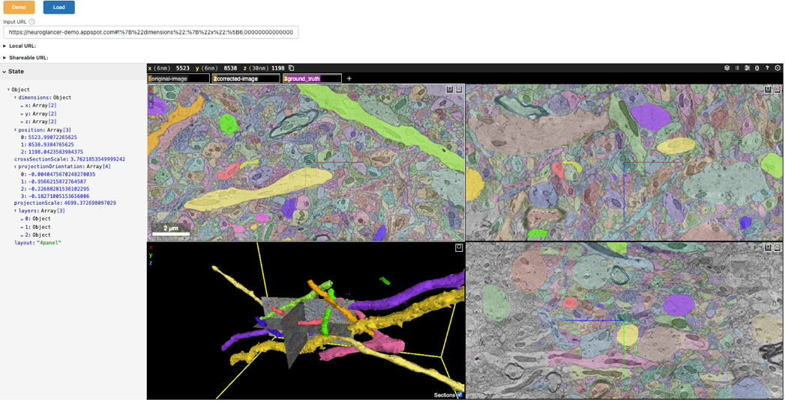

# Volumetric Imaging


---


```python
from IPython.display import HTML
HTML("""
<div style="display: flex; justify-content: center; padding: 10px;">
    <iframe width="560" height="315" src="https://www.youtube.com/embed/WztLvP5rj7U?si=BwcQexPzy7EYsfzv" title="YouTube video player" frameborder="0" allow="accelerometer; clipboard-write; encrypted-media; gyroscope; picture-in-picture; web-share" referrerpolicy="strict-origin-when-cross-origin" allowfullscreen></iframe>
</div>
""")
```

## Overview

**Volumetric imaging** refers to techniques that capture or reconstruct data in three dimensions, enabling researchers to study the internal structures and spatial relationships within a sample. For instance, in neuroscience, volumetric imaging is used to reconstruct the intricate spatial arrangements of neurons and synapses in the brain. This ability to explore spatial depth and organization makes it an essential tool in fields like biology, neuroscience, and materials science.

One of the most powerful volumetric imaging techniques is **electron microscopy** ([EM](https://en.wikipedia.org/wiki/Electron_microscope)). EM uses a beam of electrons to create high-resolution images at the nanometer scale, enabling the exploration of fine structural details of biological specimens such as cells, tissues, and molecular structures. However, handling and visualizing the massive datasets generated by EM poses significant challenges due to their size and complexity.

### Introducing **Neuroglancer**

[Neuroglancer](https://github.com/google/neuroglancer), developed by Google, is a browser-based 3D viewer tailored for volumetric datasets. Some key features include:

- **Interactive Visualization:** Smoothly navigate large, multi-dimensional volumes.
- **Customizable Layers:** Overlay raw images, segmented regions, and annotations as separate layers.
- **Web-Based Interface:** Open a Neuroglancer session directly in your browser—no special software needed.

Neuroglancer was originally created for neuroscientists studying complex neural circuits. However, its capabilities are widely relevant to anyone dealing with large volumetric data.

### Integrating Neuroglancer with **Jupyter Notebooks**

While Neuroglancer is a powerful tool for exploring large volumes, it is typically used as a standalone application. Researchers often utilize **Jupyter Notebooks** to conduct reproducible research and combine code, data analysis, and visualizations. Embedding Neuroglancer into a Jupyter Notebook provides several important benefits:

- **Single-Environment Workflow:** Code, analysis, and interactive visualization live together in the same environment.
- **Reproducibility:** You can share notebooks that not only contain the analysis steps but also embedded views of the dataset.
- **Collaboration:** Colleagues can open the same notebook and interact with the volumetric data directly.

### Using **HoloViz Panel** for the Integration

Panel provides a flexible way to embed web-based tools. With it, you can:

- Put the Neuroglancer viewer right inside a notebook cell.
- Add widgets for controlling Neuroglancer parameters (layers, position, segmentation).
- Integrate Neuroglancer views with other visualizations, annotations, or computational results side-by-side.

### Quick-Start with the **Panel-Neuroglancer** Package

To simplify the process, the class that integrates Neuroglancer with Panel is available as an installable Python package called [Panel-Neuroglancer](https://github.com/panel-extensions/panel-neuroglancer).

By installing and using this package, you can avoid manually defining the class code. Simply import the package and start visualizing your data. We'll demonstrate the out-of-the-box usage first, followed by instructions on how to customize or rebuild the integration if needed.

---

## Prerequisites

| Topic | Type | Notes |
| --- | --- | --- |
| [Panel-Neuroglancer Repo](https://panel.holoviz.org/) | Prerequisite | Awareness of installation and latest development |
| [Neuroglancer Repo](https://github.com/google/neuroglancer) | Prerequisite | Neuroglancer web app guidance |

---

## Imports and Configuration


```python
import neuroglancer
import panel as pn
import param
from neuroglancer.viewer import Viewer
from panel.custom import PyComponent
from panel_neuroglancer import Neuroglancer

pn.extension()
```

## Using Panel-Neuroglancer
Once installed, using Panel-Neuroglancer is straightforward. You can launch a Neuroglancer viewer in two main ways:

**Approach 1: Load Viewer State from a URL**  
Perfect if a collaborator sends you a Neuroglancer link that already has data and layers configured. Just paste that URL into the widget and load it directly.

**Approach 2: Start from a Pre-Configured Viewer**
Ideal if you want programmatic control. You create a `neuroglancer.Viewer`, set its layers and parameters with Python code, and then display it using the `panel-neuroglancer.Neuroglancer` class.

### Approach 1: Launch Viewer from a URL

You can either:

- Pass a valid [Neuroglancer URL]([Neuroglancer repository](https://github.com/google/neuroglancer#examples) to `Neuroglancer(source=<URL>)`.
- Launch a blank viewer using `Neuroglancer()`, paste the URL into the text input, and hit `Load`.

Optionally, Panel-Neuroglancer includes a predefined `demo` URL loader button (or `load_demo=True` when instantiating) to quickly load an example dataset and state. You can find example URLs in the [Neuroglancer repository](https://github.com/google/neuroglancer#examples).



**Here's a static snapshot of what the next cell produces. 👉**

<div style="clear: both;"></div>
 


```python
Neuroglancer(show_state=True, load_demo=True)
```

## Approach 2: Displaying a Pre-Configured Viewer

Alternatively, you can create a `neuroglancer.viewer.Viewer` object, specify layers and other settings, and then provide this as the `source` parameter. This allows you to set up the viewer programmatically and then embed it within the context of the notebook.

Below:
- We create a Neuroglancer `Viewer` instance
- Within a transaction (`viewer.txn()`), we add layers to the viewer:
  - An image layer from a precomputed data source
  - A segmentation layer
- We then pass this configured viewer to our `Neuroglancer` class
- The viewer is embedded within the Panel app and displayed in the notebook


```python
viewer = neuroglancer.Viewer()

with viewer.txn() as s:
    # Add an image layer from a precomputed data source
    s.layers["image"] = neuroglancer.ImageLayer(
        source="precomputed://gs://neuroglancer-janelia-flyem-hemibrain/emdata/clahe_yz/jpeg",
    )
    # Add a segmentation layer
    s.layers["segmentation"] = neuroglancer.SegmentationLayer(
        source="precomputed://gs://neuroglancer-janelia-flyem-hemibrain/v1.1/segmentation",
    )
```


**Here's a static snapshot of what the next cell produces. 👉**

<div style="clear: both;"></div>


```python
Neuroglancer(source=viewer, show_state=True)
```

## Customizing the `Neuroglancer` Class

The Panel-Neuroglancer package will likely meet most of your needs out of the box. However, if you'd like to customize or extend the class—or simply understand how it works—you can easily reconstruct it directly in the notebook. Customization lets you fine-tune the interface, add specific features, or streamline the user experience for your workflows.

Our class below will create a Panel object that includes the Neuroglancer viewer embedded within an iframe, along with controls to load a Neuroglancer state from a URL, display the current state JSON, and generate shareable links.

As an example of customization, imagine receiving a `NEW_URL` from a colleague and deciding to simplify the interface by reducing the number of UI elements. By commenting out a few lines of code, you can remove the `Demo` loading feature and hide the URL `Load` widget, leaving only the JSON state panel, shareable state URL dropdown, and the viewer.


```python
class CustomNeuroglancer(PyComponent):
    """
    CustomNeuroglancer is a Panel component for visualizing and interacting with a Neuroglancer Viewer
    (without the demo loading stuff).

    The component can be initialized from a URL or a `neuroglancer.viewer.Viewer` instance.
    """

    show_state = param.Boolean(default=False, doc="""
        Provides a collapsible card widget under the viewer that displays the viewer's state.""")

    url = param.String(default=None, doc="""
        The URL public URL of the Neuroglancer Viewer.""")

    def __init__(
        self,
        source=None,
        # load_demo=False,
        **params,
    ):
        viewer = None
        if isinstance(source, str):
            params['url'] = source
        elif isinstance(source, Viewer):
            params['url'] = source.get_viewer_url()
            viewer = source
        elif source is not None:
            raise ValueError('Neuroglancer source must be a URL or neuroglancer Viewer instance')
        self._source_not_provided = source is None
        super().__init__(**params)
        if viewer is None:
            viewer = neuroglancer.Viewer()
        self.viewer = viewer

        self._setup_ui_components()
        self._configure_viewer()
        self._setup_callbacks()

        if isinstance(source, str):
            self._load_state_from_url(source)
        # if load_demo:
        #     self._load_demo()

    def _setup_ui_components(self):
        self.url_input = pn.widgets.TextInput.from_param(
            self.param.url,
            placeholder="Enter a Neuroglancer URL and click Load",
            name="Input URL",
            width=700,
        )

        self.load_button = pn.widgets.Button(
            name="Load", button_type="primary", width=75
        )
        # self.demo_button = pn.widgets.Button(
        #     name="Demo", button_type="warning", width=75
        # )

        self.json_pane = pn.pane.JSON(
            {}, theme="light", depth=2, name="Viewer State", sizing_mode='stretch_both'
        )

        self.shareable_url_pane = pn.pane.Markdown("**Shareable URL:**")
        self.local_url_pane = pn.pane.Markdown("**Local URL:**")

        self.iframe = pn.pane.HTML(
            sizing_mode="stretch_both",
            aspect_ratio=self.param.aspect_ratio,
            margin=0,
            min_height=800,
            styles={"resize": "both", "overflow": "hidden"},
        )

    def _configure_viewer(self):
        self._update_local_url()
        self._update_iframe_with_local_url()

    def _setup_callbacks(self):
        self.load_button.on_click(self._load_url)
        # self.demo_button.on_click(self._load_demo)
        self.viewer.shared_state.add_changed_callback(self._on_viewer_state_changed)

    # def _load_demo(self, event=None):
    #     self.url = DEMO_URL
    #     self._load_state_from_url(self.url)

    def _load_url(self, event=None):
        self._load_state_from_url(self.url)

    def _load_state_from_url(self, url):
        try:
            new_state = self._parse_state_from_url(url)
            self.viewer.set_state(new_state)
        except Exception as e:
            print(f"Error loading Neuroglancer state: {e}")  # noqa

    def _parse_state_from_url(self, url):
        return neuroglancer.parse_url(url)

    def _on_viewer_state_changed(self):
        self._update_shareable_url()
        self._update_json_pane()

    def _update_shareable_url(self):
        self.url = shareable_url = neuroglancer.to_url(self.viewer.state)
        self.shareable_url_pane.object = self._generate_dropdown_markup(
            "Shareable URL", shareable_url
        )

    def _update_local_url(self):
        self.local_url_pane.object = self._generate_dropdown_markup(
            "Local URL", self.viewer.get_viewer_url()
        )

    def _update_iframe_with_local_url(self):
        iframe_style = (
            'frameborder="0" scrolling="no" marginheight="0" marginwidth="0" '
            'style="width:100%; height:100%; min-width:500px; min-height:500px;"'
        )
        self.iframe.object = (
            f'<iframe src="{self.viewer.get_viewer_url()}" {iframe_style}></iframe>'
        )

    def _update_json_pane(self):
        self.json_pane.object = self.viewer.state.to_json()

    def _generate_dropdown_markup(self, title, url):
        return f"""
        <details>
            <summary><b>{title}:</b></summary>
            <a href="{url}" target="_blank">{url}</a>
        </details>
        """

    def __panel__(self):
        controls = pn.Column(
            # pn.Row(self.demo_button, self.load_button, visible=self._source_not_provided),
            # pn.Row(self.url_input, visible=self._source_not_provided),
            # self.local_url_pane,
            self.shareable_url_pane
        )
        state_widget = pn.Card(
            self.json_pane,
            title="State",
            collapsed=False,
            visible=self.param.show_state,
            styles={"background": "WhiteSmoke"},
            max_width=350
        )
        return pn.Column(
            controls,
            pn.Row(state_widget, self.iframe),
        )
```

### How This Custom Class Works

Here is a summary of the key aspect of this custom Panel component:

- **Constructing the Panel Layout:**  The class inherits from PyComponent, a mechanism that lets us assemble multiple Panel components into a unified widget. The `__panel__` method defines the final layout: a card showing the viewer state (if requested) next to an iframe embedding the Neuroglancer viewer.

- **Viewer State Synchronization:** When the Neuroglancer viewer’s state changes, the callback (`_on_viewer_state_changed`) updates the JSON pane and shareable URL, maintaining alignment between the viewer and the notebook widgets. The `shared_state` object in the viewer enables this synchronization by alerting Panel to any changes within Neuroglancer.

- **URL Parsing and Generation:** Neuroglancer states can be encoded in URLs. By calling `neuroglancer.parse_url()`, we load an existing state from a shareable link. Conversely, `neuroglancer.to_url()` generates a new URL from the current state, making it easy to share your exact view with others.


**Here's a static snapshot of what the next cell produces. 👉**

<div style="clear: both;"></div>


```python
NEW_URL = "https://fafb-dot-neuroglancer-demo.appspot.com/#!%7B%22dimensions%22:%7B%22x%22:%5B4e-9%2C%22m%22%5D%2C%22y%22:%5B4e-9%2C%22m%22%5D%2C%22z%22:%5B4e-8%2C%22m%22%5D%7D%2C%22position%22:%5B109421.8984375%2C41044.6796875%2C5417%5D%2C%22crossSectionScale%22:2.1875%2C%22projectionOrientation%22:%5B-0.08939177542924881%2C-0.9848012924194336%2C-0.07470247149467468%2C0.12882165610790253%5D%2C%22projectionScale%22:27773.019357116023%2C%22layers%22:%5B%7B%22type%22:%22image%22%2C%22source%22:%22precomputed://gs://neuroglancer-fafb-data/fafb_v14/fafb_v14_orig%22%2C%22tab%22:%22source%22%2C%22name%22:%22fafb_v14%22%2C%22visible%22:false%7D%2C%7B%22type%22:%22image%22%2C%22source%22:%22precomputed://gs://neuroglancer-fafb-data/fafb_v14/fafb_v14_clahe%22%2C%22tab%22:%22source%22%2C%22name%22:%22fafb_v14_clahe%22%7D%2C%7B%22type%22:%22segmentation%22%2C%22source%22:%22precomputed://gs://fafb-ffn1-20190805/segmentation%22%2C%22tab%22:%22source%22%2C%22segments%22:%5B%22710435991%22%5D%2C%22name%22:%22fafb-ffn1-20190805%22%7D%2C%7B%22type%22:%22annotation%22%2C%22source%22:%22precomputed://gs://neuroglancer-20191211_fafbv14_buhmann2019_li20190805%22%2C%22tab%22:%22rendering%22%2C%22annotationColor%22:%22#cecd11%22%2C%22shader%22:%22#uicontrol%20vec3%20preColor%20color%28default=%5C%22blue%5C%22%29%5Cn#uicontrol%20vec3%20postColor%20color%28default=%5C%22red%5C%22%29%5Cn#uicontrol%20float%20scorethr%20slider%28min=0%2C%20max=1000%29%5Cn#uicontrol%20int%20showautapse%20slider%28min=0%2C%20max=1%29%5Cn%5Cnvoid%20main%28%29%20%7B%5Cn%20%20setColor%28defaultColor%28%29%29%3B%5Cn%20%20setEndpointMarkerColor%28%5Cn%20%20%20%20vec4%28preColor%2C%200.5%29%2C%5Cn%20%20%20%20vec4%28postColor%2C%200.5%29%29%3B%5Cn%20%20setEndpointMarkerSize%285.0%2C%205.0%29%3B%5Cn%20%20setLineWidth%282.0%29%3B%5Cn%20%20if%20%28int%28prop_autapse%28%29%29%20%3E%20showautapse%29%20discard%3B%5Cn%20%20if%20%28prop_score%28%29%3Cscorethr%29%20discard%3B%5Cn%7D%5Cn%5Cn%22%2C%22shaderControls%22:%7B%22scorethr%22:80%7D%2C%22linkedSegmentationLayer%22:%7B%22pre_segment%22:%22fafb-ffn1-20190805%22%2C%22post_segment%22:%22fafb-ffn1-20190805%22%7D%2C%22filterBySegmentation%22:%5B%22post_segment%22%2C%22pre_segment%22%5D%2C%22name%22:%22synapses_buhmann2019%22%7D%2C%7B%22type%22:%22image%22%2C%22source%22:%22n5://gs://fafb-v14-synaptic-clefts-heinrich-et-al-2018-n5/synapses_dt_reblocked%22%2C%22tab%22:%22source%22%2C%22opacity%22:0.73%2C%22shader%22:%22void%20main%28%29%20%7BemitRGBA%28vec4%280.0%2C0.0%2C1.0%2CtoNormalized%28getDataValue%28%29%29%29%29%3B%7D%22%2C%22name%22:%22clefts_Heinrich_etal%22%2C%22visible%22:false%7D%2C%7B%22type%22:%22segmentation%22%2C%22source%22:%22precomputed://gs://neuroglancer-fafb-data/elmr-data/FAFBNP.surf/mesh#type=mesh%22%2C%22tab%22:%22source%22%2C%22segments%22:%5B%221%22%2C%2210%22%2C%2211%22%2C%2212%22%2C%2213%22%2C%2214%22%2C%2215%22%2C%2216%22%2C%2217%22%2C%2218%22%2C%2219%22%2C%222%22%2C%2220%22%2C%2221%22%2C%2222%22%2C%2223%22%2C%2224%22%2C%2225%22%2C%2226%22%2C%2227%22%2C%2228%22%2C%2229%22%2C%223%22%2C%2230%22%2C%2231%22%2C%2232%22%2C%2233%22%2C%2234%22%2C%2235%22%2C%2236%22%2C%2237%22%2C%2238%22%2C%2239%22%2C%224%22%2C%2240%22%2C%2241%22%2C%2242%22%2C%2243%22%2C%2244%22%2C%2245%22%2C%2246%22%2C%2247%22%2C%2248%22%2C%2249%22%2C%225%22%2C%2250%22%2C%2251%22%2C%2252%22%2C%2253%22%2C%2254%22%2C%2255%22%2C%2256%22%2C%2257%22%2C%2258%22%2C%2259%22%2C%226%22%2C%2260%22%2C%2261%22%2C%2262%22%2C%2263%22%2C%2264%22%2C%2265%22%2C%2266%22%2C%2267%22%2C%2268%22%2C%2269%22%2C%227%22%2C%2270%22%2C%2271%22%2C%2272%22%2C%2273%22%2C%2274%22%2C%2275%22%2C%228%22%2C%229%22%5D%2C%22name%22:%22neuropil-regions-surface%22%2C%22visible%22:false%7D%2C%7B%22type%22:%22mesh%22%2C%22source%22:%22vtk://https://storage.googleapis.com/neuroglancer-fafb-data/elmr-data/FAFB.surf.vtk.gz%22%2C%22tab%22:%22source%22%2C%22shader%22:%22void%20main%28%29%20%7BemitRGBA%28vec4%281.0%2C%200.0%2C%200.0%2C%200.5%29%29%3B%7D%22%2C%22name%22:%22neuropil-full-surface%22%2C%22visible%22:false%7D%2C%7B%22type%22:%22segmentation%22%2C%22source%22:%5B%7B%22url%22:%22precomputed://gs://fafb-ffn1-20190805/segmentation%22%2C%22subsources%22:%7B%22default%22:true%2C%22bounds%22:true%7D%2C%22enableDefaultSubsources%22:false%7D%2C%22precomputed://gs://fafb-ffn1-20190805/segmentation/skeletons_32nm%22%5D%2C%22tab%22:%22source%22%2C%22selectedAlpha%22:0%2C%22segments%22:%5B%224613663523%22%5D%2C%22name%22:%22skeletons_32nm%22%2C%22visible%22:false%7D%2C%7B%22type%22:%22segmentation%22%2C%22source%22:%22precomputed://gs://fafb-ffn1/fafb-public-skeletons%22%2C%22tab%22:%22source%22%2C%22segments%22:%5B%5D%2C%22name%22:%22public_skeletons%22%2C%22visible%22:false%7D%5D%2C%22showAxisLines%22:false%2C%22showSlices%22:false%2C%22layout%22:%22xy-3d%22%7D"
CustomNeuroglancer(source=NEW_URL, show_state=True)
```

## Next Steps

- **Explore Your Own Datasets:** Modify the code to load and visualize your own volumetric datasets.
- **Extend the Application:** Integrate additional HoloViews plots or other Panel components to create a more comprehensive application. For instance, you might add controls for adjusting visualization parameters.
- **Share and Collaborate:** Use the shareable URLs generated by the app to share specific views or states with collaborators. Embedding the application in a notebook ensures that your analysis and visualizations are reproducible and shareable.

---

## Resources

| Resource | Description |
| --- | --- |
| [Panel Tutorials](https://panel.holoviz.org/) | Familiarity with Panel for building interactive apps |
| [Neuroglancer Python Integration](https://github.com/google/neuroglancer/tree/master/python) | Python interface for controlling Neuroglancer |


```python

```
